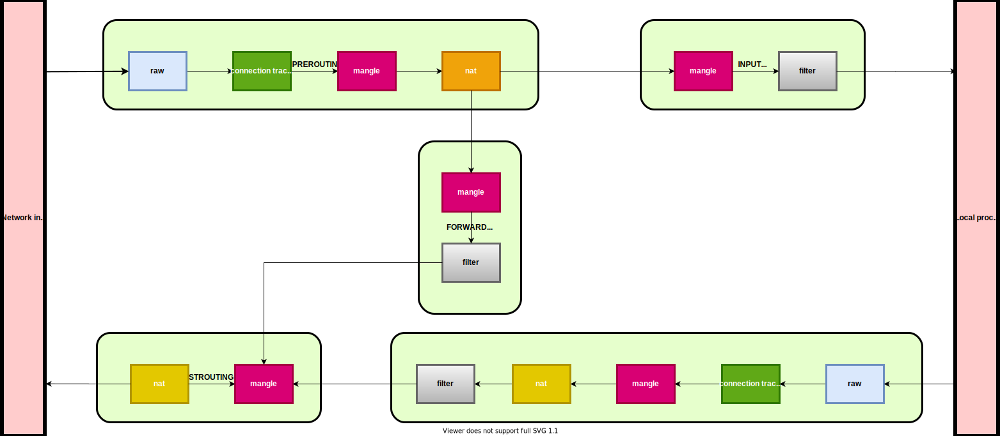

## iptables role

Для конфигурации iptables используется ferm (http://ferm.foo-projects.org/download/2.4/ferm.html)
Также используется модуль ipset (http://ipset.netfilter.org/ipset.man.html)

Поток трафика по таблицам и цепочкам в "обычной" жизни выглядит следующим образом:

 

Подробнее о архитектуре - см. поиск в [любимой поисковой системе](https://www.google.com).
 Например, отличное руководство (правда без картинок) есть на сайте
 [DigitalOcean](https://www.digitalocean.com/community/tutorials/a-deep-dive-into-iptables-and-netfilter-architecture)

Управлять файлами iptables мы можем на несокльких уровнях: group_vars, host_vars.
По дефолту для всех хостов используется:

```
ferm_rules:
  raw:
    PREROUTING:
      rules:
        - {rule: "mod set set deny_hosts src DROP;",  comment: "global policy"}
  filter:
    INPUT:
      rules:
        - {rule: "policy DROP;",  comment: "global policy"}
        - {rule: "mod state state INVALID DROP;", comment: "connection tracking: drop"}
        - {rule: "mod state state (ESTABLISHED RELATED) ACCEPT;", comment: "connection tracking"}
        - {rule: "interface lo ACCEPT;", comment: "allow local packet"}
        - {rule: "proto icmp icmp-type (echo-request) ACCEPT;", comment: "respond to ping"}
        - {rule: "saddr (10.0.0.0/8 172.16.0.0/12 192.168.0.0/16) ACCEPT;", comment: "allow local connections"}
        - {rule: "mod set set allowed_ports dst ACCEPT;", comment: "Allow connections to dst ports"}
        - {rule: "mod set set allowed_hosts src ACCEPT;", comment: "Allow connections from src hosts"}
        - {rule: "mod set set allowed_hosts_to_ports (src dst) ACCEPT;", comment: "Allow connections from src hosts to dst ports"}
```

Мы можем переопределить данные правила для конкретного хоста, для этого необходимо:

- создать yml файл в директории [host_vars](../../host_vars) назвать его также, как хост
- наполнить файл следующим содержанием:

```
ferm_rules:
  raw:
    PREROUTING:
      rules:
        - {rule: "policy ACCEPT;",  comment: "global policy"}
  filter:
    INPUT:
      rules:
        - {rule: "policy ACCEPT;",  comment: "global policy"}
```

Тем самым мы переопределили вышестоящие дефолтовые правила фаервола в group_vars all.

## Дружба iptables с docker совместно с нашими правилами

На всех хостах в нашей инфраструктуре устанавливается docker-engine.

В свежих версиях docker-engine научился управлять правилами iptables, и
 распоряжается ими как у себя дома. В доке (см. страницу
 [Docker and iptables](https://docs.docker.com/network/iptables))
 разработчики постарались объяснить что там делается и даже предложили свой
 подход к "пользовательским" правилам. Для этого они выделили аж одну таблицу:
 **filter/DOCKER-USER**, куда перекидывают правила из **filter/FORWARD**.

По факту docker-engine управляет таблицами/цепочками:
 - nat/PREROUTING
 - filter/FORWARD
 - nat/OUTPUT
 - nat/POSTROUTING

А также добавляет свои:
 - nat/DOCKER
 - filter/DOCKER
 - filter/DOCKER-ISOLATION-STAGE-1
 - filter/DOCKER-ISOLATION-STAGE-1

Таким образом, чтобы иметь свои правила не только в **filter/DOCKER-USER**,
 мы добавляем ещё три таблицы для кастомных правил и используем их:
 - nat/PREROUTING-DOCKER-USER
 - nat/OUTPUT-DOCKER-USER
 - nat/POSTROUTING-DOCKER-USER

И в нашей инфраструктуре поток трафика выглядит уже следующим образом:

 


## Проброс портов или port forwarding

Проброс портов на конкретной машине можно делать следующим правилом в host_vars этой машины, где 207.244.100.102 - пример адреса на который идет трафик, 10.6.10.143 - адрес на который мы форвардим трафик:

```
ferm_rules:
  nat:
    PREROUTING-DOCKER-USER:
      default_rules: []
      rules:
        - {rule: "daddr 207.244.100.102/32 proto tcp dport 9999 DNAT to 10.6.10.143:80;",  comment: "port forwarding"}
    POSTROUTING-DOCKER-USER:
      default_rules: []
      rules:
        - {rule: "daddr 10.6.10.0/24 SNAT to 10.6.10.102;",  comment: "port forwarding"}
```

## Управление ipset

Политика фаервола следующая: то что не разрешено, запрещено. Поэтому мы разрешаем доступ изменяя наполнение соответствующих ipset таблиц.

Определено несколько дефолтовых таблиц ipset:
- deny_hosts - запрещает трафик от src host к нашему хосту
- allowed_ports - разрешает трафик к dst port нашего хоста
- allowed_hosts - разрешает трафик от src host к нашему хосту
- allowed_hosts_to_ports - разрешает трафик от определенных src hosts к определенным dst port нашего хоста

Наполнять наши таблицы ipset мы можем в group_vars и host_vars, правила соединяются. Пример:
```
ipset_tables:
  allowed_hosts:
    set_option: 'hash:net family inet hashsize 1024 maxelem 65536 comment'
    add_items:
      office1: 7.7.7.6/32
      office2: 6.6.6.6/32
      office3: 6.6.6.5/32
      office4: 6.6.6.8/32
      office5: 6.6.4.0/27
  deny_hosts:
    set_option: 'hash:net family inet hashsize 1024 maxelem 65536 comment'
    add_items:
      google: 8.8.8.9/32
  allowed_ports:
    set_option: 'bitmap:port range 0-65535 comment'
    add_items:
      http: tcp:80
      https: tcp:443
  allowed_hosts_to_ports:
    set_option: 'hash:net,port comment'
    add_items:
      test: 1.1.1.1/32,tcp:80
```
Пояснения по таблице allowed_hosts:
- set_option - устанавливает тип таблицы ipset
- add_items - хеш из значений, которые дожны быть в ipset таблице, например office1: 7.7.7.6/32 будет выглядеть как:
```
Name: allowed_hosts
Type: hash:net
Revision: 4
Header: family inet hashsize 1024 maxelem 65536 comment
Size in memory: 17336
References: 1
Members:
7.7.7.6 comment "office1"
```
## Пример прокатки роли для машины wdc-6-front-0:

В репозитории ops/ansible:
```
./bin/ansible-playbook -p anyrole.yml -s wdc-6-front-0 -x wdc-controller-1.tradingview.com -- -e target_role="iptables" -D
```

## Autoban

Скрипт [автобана](files/autoban.rb) работает совместно с ipset. Запускается по крону. Для раскатки необходимо 
- создать правило `iptables`, блокирующиее все ип из ipset'а _auto_ban_:
```
ipset_table:
  raw:
    PREROUTING:
      default_rules:
        - rule: "mod set set auto_ban (src dst) DROP;"
          comment: "for auto_ban script"
        - rule: "mod set set deny_hosts src DROP;"
          comment: "global policy"
```
- создать ipset:
```
ipset_tables:
  auto_ban:
    set_option: 'hash:net family inet hashsize 1024 maxelem 65536'
    entries: {}
```
