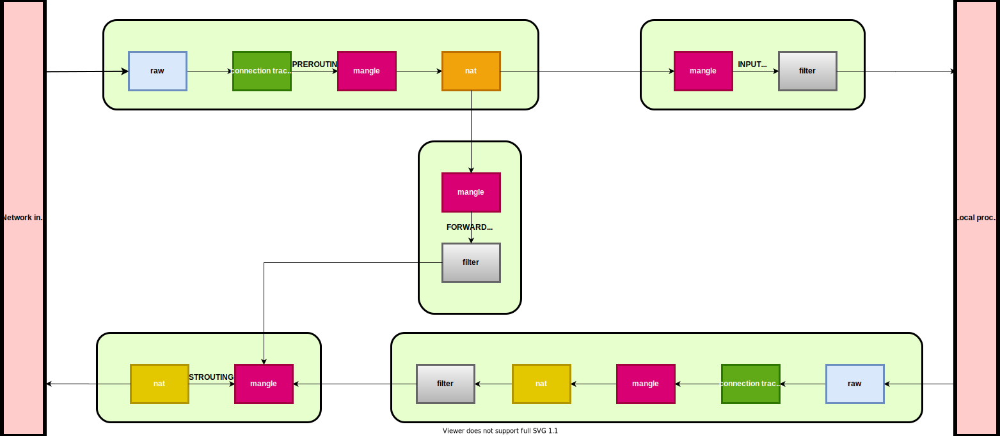

# iptables

Install and configure iptables and ipset.
iptables workflow diagram 
## Tips
### Show current rules
```
iptables-ipset.sh
```
Or separately, list iptables rules:
```
sudo iptables -nvL
sudo iptables -nvL -t nat
```
Show ipset lists:
```
sudo ipset list
```
### Additional iptables-ipset.sh options
```
iptables-ipset.sh --help
```


## Table of contents

- [Requirements](#requirements)
- [Default Variables](#default-variables)
  - [iptables_control_script](#iptables_control_script)
  - [iptables_default_ipset_tables__to_merge](#iptables_default_ipset_tables__to_merge)
  - [iptables_ipset_config_dir](#iptables_ipset_config_dir)
  - [iptables_ipset_tables](#iptables_ipset_tables)
  - [iptables_rules_dir](#iptables_rules_dir)
  - [iptables_v4_rules](#iptables_v4_rules)
- [Discovered Tags](#discovered-tags)
- [Dependencies](#dependencies)
- [License](#license)
- [Author](#author)

---

## Requirements

- Minimum Ansible version: `2.16`

## Default Variables

### iptables_control_script

Path to the iptables configuration script.

#### Default value

```YAML
iptables_control_script: /usr/bin/iptables-ipset.sh
```

### iptables_default_ipset_tables__to_merge

These rules are added by default.

#### Default value

```YAML
iptables_default_ipset_tables__to_merge:
  - name: public-ssh
    set_option: bitmap:port range 0-65535
    items: [22]
```

### iptables_ipset_config_dir

Directory containing ipset lists.

#### Default value

```YAML
iptables_ipset_config_dir: /etc/ipset
```

### iptables_ipset_tables

Used to add ipset tables via [ipset.yml](tasks/ipset.yml).
Each item must have attributes: name, set_option,
(items or src_groups).
If src_groups is used, dport can be specified.
Populated from ${uniq_prefix}_ipset_tables__to_merge variables
in group_vars or host_vars.

#### Default value

```YAML
iptables_ipset_tables: "{{ lookup('community.general.merge_variables', 'ipset_tables__to_merge',
  pattern_type='suffix') }}"
```

#### Example usage

```YAML
- name: public_tcp
  set_option: bitmap:port range 0-65535
  items: [80, 443]
# allow all hosts from the ingress group to connect to port 3100
- name: loki
  set_option: hash:net,port comment
  src_groups: [ingress]
  dport: 3100
# allow all hosts from trusted and admins groups to connect to any port
- name: trusted
  set_option: hash:net comment
  src_groups: [trusted, admins]
# allow all hosts from the vpns group with public IPs to connect to any port
- name: private
  set_option: hash:net comment
  src_groups: [vpns]
  src_ip_type: public_ip
# allow hosts from the vpns group and the Dallas subnet to connect to port 8005
- name: http-emails
  set_option: hash:net,port
  src_groups: [vpns]
  dport: 8005
  items:
    - 10.2.0.0/24,8005 comment "net=private"
# log incoming connections from 10.1.0.0/24 network
# that did not match any allow rules
- name: log_my_networks
  set_option: hash:net
  jump: LOG
  items:
      - 10.1.0.0/24 comment "location=my"
```

### iptables_rules_dir

Directory containing iptables rules.

#### Default value

```YAML
iptables_rules_dir: /etc/iptables
```

### iptables_v4_rules

Path to the IPv4 rules file for iptables-(save|persistent).

#### Default value

```YAML
iptables_v4_rules: /etc/iptables/rules.v4
```

## Discovered Tags

**_bin_**

**_conf_**

**_dir_**

**_ipset_**

**_iptables_**

**_package_**

**_v6conf_**

## Dependencies

None.

## License

ISC

## Author

Stanislav Korolev
